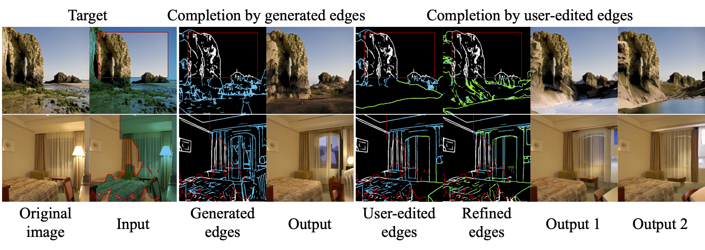

# SGDM (BMVC2023)
<a href='https://arxiv.org/abs/2211.10437'></a> &nbsp; 
<a href='https://udonda.github.io/Structure_Guided_Diffusion_Model/'></a> &nbsp; 

The official PyTorch implementation for the following paper:
> [**A Structure-Guided Diffusion Model for Large-Hole Image Completion**](https://arxiv.org/abs/2211.10437),  
> Daichi Horita, Jiaolong Yang, Dong Chen, Yuki Koyama, Kiyoharu Aizawa, Nicu Sebe  
> *BMVC 2023*

# TODO
- [x] Add project page
- [ ] Add pretrained models
- [ ] Add training code
- [ ] Add evaluation code
- [ ] Add dataset split


# Citation
If you find our work useful for your research, please consider citing our paper:
```bibtex
@inproceedings{horita2023structureguided
  title={A Structure-Guided Diffusion Model for Large-Hole Image Completion}, 
  author={Daichi Horita and Jiaolong Yang and Dong Chen and Yuki Koyama and Kiyoharu Aizawa and Nicu Sebe},
  year={2023},
  booktitle   = {BMVC},
  year      = {2023},
}
```